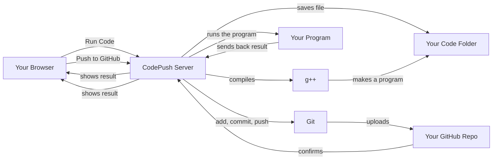

# CodePush — A Local Coding Practice Tool

CodePush is a simple website that runs on your own computer. It lets you write code, test it, and save it to GitHub — all from one page in your browser.


---

## What's in the Project

- `codepush/` — the main project folder
- `codepush/code_editor/` — the part of the app that runs the editor
  - `views.py` — the code that does the real work (saving files, compiling, running, pushing to GitHub)
  - `templates/editor/index.html` — the webpage you actually see and type in
- `.env` — a small settings file (where you tell the app which folder to save your code in)

---

## Setting It Up

You'll need:
- Python 3.8 or newer, plus pip
- Git
- g++ (used to compile C++ code)

**Steps:**

1. Create a separate Python environment and install what's needed:

```bash
python -m venv .venv
source .venv/Scripts/activate    # On Windows: .venv\Scripts\activate
pip install -r requirements.txt  # If this file doesn't exist yet, create it with: django, python-dotenv
```

2. Create a settings file at `codepush/codepush/.env` and tell it where to save your code:

```env
REPO_PATH="D:/path/to/your/local/code/repo"
DEBUG_MODE=TRUE
```

**Tip:** If your folder path has a `#` symbol or spaces in it, wrap it in quotes like above. Otherwise the settings tool might ignore part of the path.

3. Start the website:

```bash
cd codepush
python manage.py migrate
python manage.py runserver
```

Then open **http://127.0.0.1:8000/** in your browser.

---

## How It Works (The Basics)

The page has a code editor box where you type your solution. There are two buttons:

- **Run Code** — sends your code to the server to compile and run it
- **Push to GitHub** — saves your code and uploads it to your GitHub repository

### What happens when you click "Run Code"

1. Your browser sends your code (plus some details like the problem name) to the server.
2. The server saves your code as a file, inside a folder named after the problem.
3. The server compiles it using g++.
4. If it compiles fine, the server runs it with your test input and sends back the output.

### What happens when you click "Push to GitHub"

1. Your browser tells the server which problem you're pushing.
2. The server checks that your save-folder actually exists.
3. The server runs three Git commands: add the files, commit them with a message, and push them to GitHub.
4. It sends back a message saying whether it worked — and if not, what went wrong.

---

## The Server Code (`views.py`) — In Plain Terms

There are two main functions:

**`execute_code`** — handles the "Run Code" button:
- Saves your code to a file
- Compiles it with g++
- Runs it with a 3-second time limit (so it can't run forever)
- Sends back whatever the program printed, or any error

**`push_to_github`** — handles the "Push to GitHub" button:
- Builds a commit message
- Checks your save-folder exists
- Runs `git add`, `git commit`, and `git push`
- Sends back the result of each step, so you can see exactly where something failed (like "nothing to commit" or a login problem)

---

## The Webpage (`index.html`) — In Plain Terms

- The typing box on the page is powered by a code editor tool called CodeMirror.
- When you click **Run Code**, it bundles up your code and sends it to the server, then shows the result in a box below.
- When you click **Push to GitHub**, it sends your problem info to the server and shows you a pop-up with the result.

Simplified version of that logic:

```js
async function runCode() {
  const data = { code: editor.getValue(), rating, contest, problem, input }
  const resp = await fetch('/execute/', { method: 'POST', body: JSON.stringify(data) })
  const result = await resp.json()
  outputArea.value = result.output || result.error
}

async function pushCode() {
  const resp = await fetch('/push/', { method: 'POST', body: JSON.stringify(metadata) })
  const result = await resp.json()
  alert(result.message || result.stderr || result)
}
```

---

## Safety Notes

- This tool runs code you type directly on your computer — that's risky if other people can reach it. **Keep it running only on your own machine, not on the public internet.**
- Code execution has a 3-second limit, so an infinite loop won't freeze things forever.
- Don't accidentally save compiled program files (like `.exe` or `main`) to GitHub — this project already ignores those by default.

---

## Common Problems

**"src refspec refs/heads/main does not match any"**
This means you haven't made a single commit yet. Fix it by running:
```bash
git add .
git commit -m "your message"
git push -u origin main
```

**Your folder path looks empty/broken in the app**
Make sure it's wrapped in quotes in your `.env` file, especially if it has a `#` in it:
```env
REPO_PATH="D:/##RECOVERY/Downloads/dsa codes/codes/codeforces_questions_cp31"
```

**Push fails because of login**
Set up an SSH key, or use a Personal Access Token if you're pushing over HTTPS.

---

## How Everything Connects (Simple Flow)



In short:
- **Run Code** → saves your file → compiles it → runs it → shows you the result
- **Push to GitHub** → saves + uploads your code → tells you if it worked

---

## Ideas for Improving This Later

- Automatically block compiled files (like `.exe`) from being pushed to GitHub
- Keep a log file of Git activity for troubleshooting
- Run code inside a sandbox (like Docker) if you ever plan to let others use this tool

---

## Quick Reference Commands

Start the server:
```bash
python manage.py runserver
```

Push manually if the website button doesn't work:
```bash
cd "D:/path/to/repo"
git add .
git commit -m "Add solutions"
git push -u origin main
```
