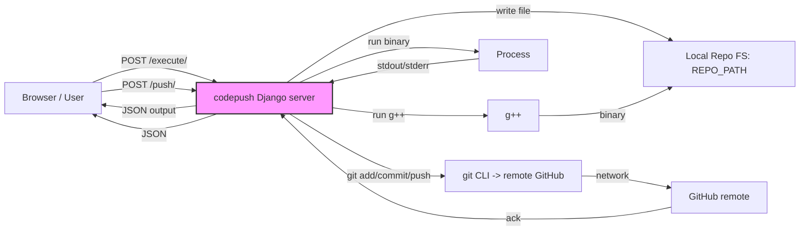

**CodePush — Local Codeforces Judge (codepush)**

This README documents the `codepush` project's *codepush* component (the Django app and the `code_editor` app). It explains how the web-based editor works, how code is compiled and run locally, and how solutions are pushed to your GitHub repository. The goal is to make the project easy to set up and to explain the data flow in simple terms.

**Repository Layout (relevant)**
- `codepush/` — Django project root (contains settings and wsgi)
- `codepush/code_editor/` — app with editor UI and views
  - `views.py` — main server-side logic for compile/run/push
  - `templates/editor/index.html` — front-end editor UI
- `.env` — local configuration (REPO_PATH, DEBUG_MODE)

**Quick Setup**
Prerequisites:
- Python 3.8+ and pip
- Git
- g++ (for compiling C++ locally)

Steps:

1. Create and activate a virtualenv (recommended):

```bash
python -m venv .venv
source .venv/Scripts/activate    # Windows: .venv\Scripts\activate
pip install -r requirements.txt  # create this file if missing: django, python-dotenv
```

2. Create a `.env` file at `codepush/codepush/.env` (example):

```env
REPO_PATH="D:/path/to/your/local/code/repo"
DEBUG_MODE=TRUE
```

Important: quote `REPO_PATH` if the path contains `#` or spaces — `python-dotenv` treats `#` as comment otherwise.

3. Run Django server:

```bash
cd codepush
python manage.py migrate
python manage.py runserver
```

Open http://127.0.0.1:8000/ to use the editor.

**How the editor works (high level)**

- The front-end uses a CodeMirror editor embedded in `templates/editor/index.html`.
- When you click "Run Code", the browser sends a POST request to `/execute/` with JSON containing `code`, `rating`, `contest`, `problem`, and `input`.
- When you click "Push to GitHub", the browser sends a POST request to `/push/` with `rating`, `contest`, and `problem` metadata.

**Key server-side flow (requests → Django views → git/compile)**

Sequence for running code:

1. Browser POST `/execute/` → `code_editor.views.execute_code`
2. Server writes code to disk: `REPO_PATH/<rating>/<contest>/<problem>/main.cpp`
3. Server runs `g++ main.cpp -o main` to compile
4. If compilation succeeds, server runs the binary with provided input (capturing stdout/stderr) and returns the output JSON to client

Sequence for pushing code to GitHub (via `push_to_github`):

1. Browser POST `/push/` → `code_editor.views.push_to_github`
2. Server validates `REPO_PATH` exists
3. Server runs `git add .`, `git commit -m '...'`, and `git push -u origin HEAD`, capturing stdout/stderr
4. Server returns JSON describing success or detailed git error output

**Important file: `code_editor/views.py` — main parts explained**

Below are the key parts of the `views.py` logic (simplified):

```python
load_dotenv()
REPO_PATH = os.getenv("REPO_PATH")

@csrf_exempt
def execute_code(request):
    # 1) parse JSON, save code to file under REPO_PATH
    # 2) compile using g++: subprocess.run(['g++', file_path, '-o', executable])
    # 3) run executable with subprocess.run([...], input=test_input, timeout=3)
    # 4) capture stdout/stderr and return JSON

@csrf_exempt
def push_to_github(request):
    # Parse metadata and build a commit message
    # Validate REPO_PATH exists
    # Run: git add ., git commit -m ..., git push -u origin HEAD
    # Capture stdout and stderr for each step and return useful JSON
```

Why we capture stdout/stderr:
- If a `git commit` returns non-zero, the view returns the `commit.stderr` (commonly "nothing to commit").
- If `git push` fails (auth, refspec, etc.), the view returns push stderr to help debug.

**Front-end: `templates/editor/index.html` (main pieces)**

- The page includes a CodeMirror instance attached to a `textarea`.
- `runCode()` packages `editor.getValue()` plus metadata and test input into JSON and POSTs to `/execute/`.
- The returned JSON's `output` or `error` is shown in the output textarea.
- `pushCode()` POSTs metadata to `/push/`, and shows the returned message.

Example front-end flow (simplified JS):

```js
async function runCode() {
  const data = { code: editor.getValue(), rating, contest, problem, input }
  const resp = await fetch('/execute/', { method:'POST', body: JSON.stringify(data) })
  const result = await resp.json()
  outputArea.value = result.output || result.error
}

async function pushCode() {
  const resp = await fetch('/push/', { method:'POST', body: JSON.stringify(metadata) })
  const result = await resp.json()
  alert(result.message || result.stderr || result)
}
```

**Security and safety notes**
- Running arbitrary code on the server is dangerous. This project runs compilation and execution locally on your machine — do not expose it to public networks.
- Use a short `timeout` (e.g. 3s) for subprocess execution to prevent infinite loops.
- Avoid committing compiled binaries to git. Add `*.exe`, `main`, etc. to `.gitignore` (this repo already includes those entries).

**Troubleshooting**

- If pushes fail with `src refspec refs/heads/main does not match any`:
  - This means there was no commit on the branch yet. Create a commit locally with `git add . && git commit -m "msg"` and push with `git push -u origin main`.
- If `.env` contains `#` in the path and `REPO_PATH` appears empty in Django, quote the path in `.env`:

```env
REPO_PATH="D:/##RECOVERY/Downloads/dsa codes/codes/codeforces_questions_cp31"
```

- If `git push` fails due to authentication, configure either SSH keys or use a Personal Access Token for HTTPS pushes.

**Diagrams / Flow (simple HLD)**

Below is a simple mermaid diagram showing the main request/processing flow. It is intentionally high-level for learning purposes.



Another simplified box diagram (text):

- Browser (CodeMirror UI)
  -> Django `execute_code` -> write file -> compile -> run -> return output
  -> Django `push_to_github` -> git add/commit/push -> return git result

**Recommended next steps / improvements**
- Add server-side checks to prevent committing compiled binaries (look for `*.exe`, `*.out`) before `git add`.
- Log git stdout/stderr to a secure server-side log file for auditing.
- Consider implementing a sandbox (e.g., Docker) if you plan to expose this to others.

**Appendix: Useful commands**

- Start server:
```bash
python manage.py runserver
```

- Manually push repo (if web push fails):
```bash
cd "D:/path/to/repo"
git add .
git commit -m "Add solutions"
git push -u origin main
```

If you want, I can also add a quick `README` for the `code_editor` app inside `code_editor/` with inline links to `views.py` and the template. Tell me if you want that and whether to include the full `views.py` contents verbatim.

---
Generated by the project helper — concise and focused on `codepush` setup and flow.
